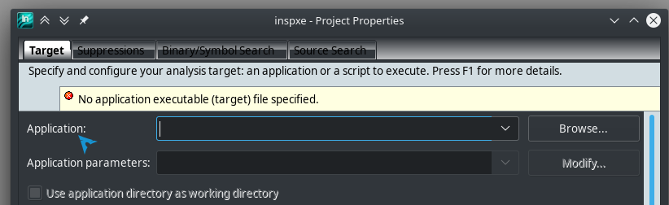
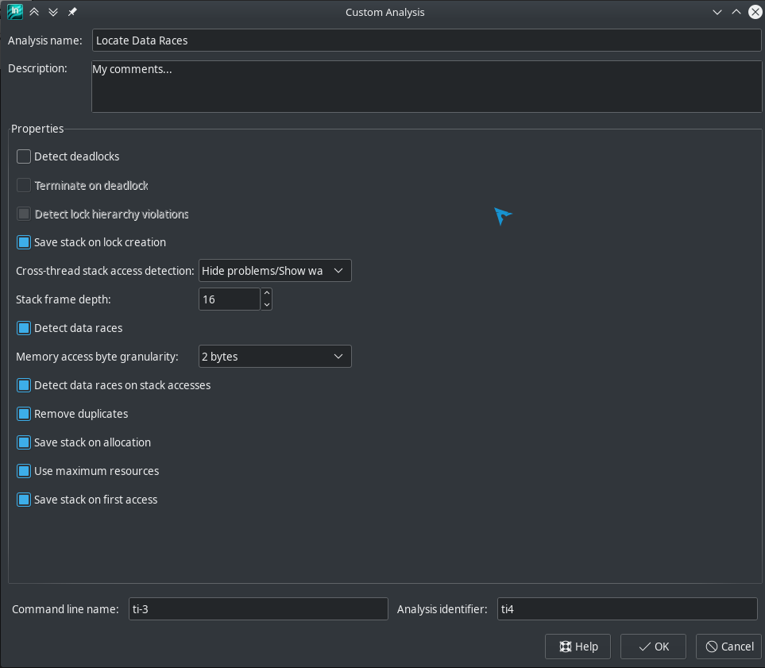

# Lock free debug tools

Concurrency is hard but can improve speed of programs.
For that it must be well designed. As for all programs it must be with the less bugs as possible,
therefore we use and need tools to guide and correct us.

There are many technics to do concurrent programs and at some point we have to synchronize our threads to make them communicate.
These synchronizations can be effectively made with **locks** (eg: mutexes) or with **lock-free technics**
allowing our threads to cooperate enabling maximum concurrency (some thread makes progress every step).
This is also more robust, there is less dependencies with other threads (no locks).

Unfortunately lock-free programming has drawbacks and is more complicated than lock based counterpart.
For instance to design lock-free algorithms you must be sure to not break invariants all the time as you can't exclude other threads when updating things.
You must be aware of the order in which the data will be visible to other threads. And use atomics to avoid undefined behavior.
I will discuss about these problems in the next sections.

If you want an introduction to lock-free programming I would recommend you to read [this article](https://preshing.com/20120612/an-introduction-to-lock-free-programming/) by Jeff Preshing.
And an in-depth book about concurrency: [C++ Concurrency in action](#cpp_concurrency_in_action) by Anthony Williams
See [references](#References) for more.

Table of Contents:

- [Lock free debug tools](#Lock-free-debug-tools)
  - [Problems in lock-free programming](#Problems-in-lock-free-programming)
    - [Data race](#Data-race)
    - [Race Condition](#Race-Condition)
    - [Memory reordering](#Memory-reordering)
    - [Livelock](#Livelock)
    - [Starvation](#Starvation)
    - [false sharing](#false-sharing)
    - [ABA' problem](#ABA-problem)
  - [Tools](#Tools)
    - [Valgrind: DRD](#Valgrind-DRD)
      - [DRD principal usage](#DRD-principal-usage)
      - [DRD options](#DRD-options)
      - [DRD tests](#DRD-tests)
    - [Valgrind: Helgrind](#Valgrind-Helgrind)
      - [Helgrind principal usage](#Helgrind-principal-usage)
      - [Helgrind options](#Helgrind-options)
      - [Helgrind tests](#Helgrind-tests)
    - [ThreadSanitizer (tsan)](#ThreadSanitizer-tsan)
      - [ThreadSanitizer principal usage](#ThreadSanitizer-principal-usage)
      - [ThreadSanitizer options](#ThreadSanitizer-options)
      - [ThreadSanitizer tests](#ThreadSanitizer-tests)
    - [Intel Inspector (Free version)](#Intel-Inspector-Free-version)
      - [Intel Inspector principal usage](#Intel-Inspector-principal-usage)
      - [Intel Inspector options](#Intel-Inspector-options)
      - [Intel Inspector tests](#Intel-Inspector-tests)
    - [CppMem](#CppMem)
      - [CppMem principal usage](#CppMem-principal-usage)
      - [Output explanation](#Output-explanation)
      - [Tests](#Tests)
    - [Other tools](#Other-tools)
    - [Notes](#Notes)
  - [Summary](#Summary)
  - [References](#References)

## Problems in lock-free programming

### Data race

A data race is a situation in which at least two threads access a shared variable at the same time (unsynchronized), and at least one thread tries to modify the variable.

See an [example](./code/data_race/data_race_simple.cpp).

### Race Condition

A race condition is a situation in which the result of an operation depends on the interleaving of certain individual operations.

In red the data races, in green the race conditions ([code](./code/data_race/data_race_race_cond.cpp)):


### Memory reordering

Memory reordering can lead to a completely different program from the source code. This is due to compiler optimizations but also during runtime the processor may reorder stores and loads.

For example, can you guess possible outputs of this [program](./code/memory_ordering/store_load_relaxed.cpp) ?
(Suppose operations on x and y atomic):

```cpp
int main() {
  int x = 0;
  int y = 0;
  int r1;
  int r2;
  std::thread      t1([&] {
    y = 1;  // #1
    r1 = x; // #2
  });
  std::thread      t2([&] {
    x = 1;  // #3
    r2 = y; // #4
  });
  t1.join();
  t2.join();
  std::cout << "r1: " << r1 << ", r2: " << r2 << "\n";
  return 0;
}

/* it could be:
r1: 0, r2: 1
r1: 1, r2: 0
r1: 1, r2: 1
right ? but this could also be:
r1: 0, r2: 0
it can arise if #1 #2 or #3 #4 are reordered (store/load reorder)
to prevent memory reordering use barrier or std::atomic with memory_order
(by default it is sequentially consistent)
*/
```

Here is the reference of [C++ memory ordering](https://en.cppreference.com/w/cpp/atomic/memory_order) it explain with example different type of memory ordering.

I recommend you to read [memory ordering at compile time](https://preshing.com/20120625/memory-ordering-at-compile-time/) by Jeff Preshing.
And also [memory barriers are like source control operations](https://preshing.com/20120710/memory-barriers-are-like-source-control-operations/).

### Livelock

Livelock, like deadlock, is when one thread is waiting for
another, which is in turn waiting for the former.
The difference is the wait is non blocking but active such as spin-lock.

### Starvation

Starvation is when some thread(s) access shared part frequently preventing other thread(s) to make progress\
Lock-free program does not necessarily prevent starvation.

### false sharing

False sharing is when 2 variable accessed frequently be 2 different threads are on the same cache line,
thus the threads must acquire exclusivity of that cache line preventing real parallelism.

### ABA' problem

ABA can appear in lock-free program when using CAS (compare and swap),
[example](./code/aba/aba.cpp) or [example trying to provoc ABA](./code/aba/aba_detect.cpp)


Multiple solutions exist:

- Double length CAS with modification counter
- Reference counter ([shared_ptr with atomic](./code/aba/aba_fixed.cpp), not necessarily lock-free but portable C++11, simplified in C++20 `std::atomic<shared_ptr<>>`)
- Hazard pointers
- lazy garbadge collection
- garbage collector
- Not freeing memory

***note** lock-free programs are not necessarily starvation free*

## Tools

These tools have been tested on:

- <a name="m1"></a>Machine 1(M1): ArchLinux `Linux 5.1.15-arch1-1-ARCH #1 SMP PREEMPT Tue Jun 25 04:49:39 UTC 2019 x86_64 GNU/Linux` (Intel i7-6700HQ (8 cores) 3.5GHz)
  - gcc version 9.1.0-2 (GCC)
  - clang version 8.0.0-4 (tags/RELEASE_800/final)

**Note**: Outputs may differs depending on compilers and options:

- Compilers:
  - gcc
  - clang
- Standard library:
  - libstdc++ (gnu)
  - libc++    (llvm)
- Options:
  - `-g`: debug info (file name, symbols, line:column number)

The tools will be tested with different options and differences will be reported.

The tools will be tested with small C++ programs (multiple times for dynamic tools), focused on lock-free.\

Each **test with error** will be run on a loop, for the first run it will not loop.
Then if the tool does not detect the error, we will try to loop 10 times and try again with 100 times and 1000 times.

Each **correct test** will be run on a loop, we will do 4 run: no loop, loop 10 times, loop 100 times, loop 1000 times.
For static tools we won't use loops of course

Tests list:

- **Programs with bugs**:
  - Data races
    - [Simple data race](./code/data_race/data_race_simple.cpp)
    - [Simple data race CppMem](./code/data_race/data_race_simple.cppmem)
    - [Data race on std::string](./code/data_race/data_race_string.cpp)
    - [Data race trying to notify through boolean flag](./code/data_race/pseudo_notif.cpp)
    - [Data race trying to notify through boolean flag CppMem](./code/data_race/pseudo_notif.cppmem)
    - [Data race on complex type std::map](./code/data_race/race_map.cpp)
    - [Data race and race condition](./code/data_race/data_race_race_cond.cpp)
    - [Data race on object destruction](./code/data_race/race_destruction.cpp)
    - [Data race on small std::string destruction](./code/data_race/race_destruction_SSO.cpp)
    - [Data race on std::string destruction](./code/data_race/race_destruction_string.cpp)
  - ABA':
    - [ABA' problem in a stack DS](./code/aba/aba.cpp)
    - [ABA' problem in a stack DS (threads launched at the same time)](./code/aba/aba_sync.cpp)
    - [ABA' problem in a stack DS (tweaked to provoc it) ¹](./code/aba/aba_detect.cpp)
  - Wrongly synchronized producer consumer:
    - [Notification load relaxed](./code/prod_cons/notif_wrong_acq_rel.cpp)
    - [Notification load relaxed CppMem](./code/prod_cons/notif_wrong_acq_rel.cppmem)
    - [Notification load relaxed in loop](./code/prod_cons/notif_wrong_acq_rel_2.cpp)
    - [Notification load relaxed in loop CppMem](./code/prod_cons/notif_wrong_acq_rel_2.cppmem)
    - [Notification load/store relaxed](./code/prod_cons/notif_relaxed.cpp)
    - [Notification load/store relaxed CppMem](./code/prod_cons/notif_relaxed.cppmem)
- **Correct programs**:
  - Atomic:
    - [Fix simple data race](./code/atomic/atomic_fix_data_race_simple.cpp)
    - [Fix simple data race CppMem](./code/atomic/atomic_fix_data_race_simple.cppmem)
    - [Fix simple data race relaxed](./code/atomic/atomic_fix_data_race_relaxed.cpp)
    - [Fix simple data race relaxed CppMem](./code/atomic/atomic_fix_data_race_relaxed.cppmem)
  - Producer consumer:
    - [Notification sequentially consistent](./code/prod_cons/notif_seq_cst.cpp)
    - [Notification sequentially consistent CppMem](./code/prod_cons/notif_seq_cst.cppmem)
    - [Notification acquire release](./code/prod_cons/notif_acq_rel.cpp)
    - [Notification acquire release CppMem](./code/prod_cons/notif_acq_rel.cppmem)
  - [ABA' fixed](./code/aba/aba_fixed.cpp)
  - Memory ordering
    - [store/load sequentially consistent](./code/memory_ordering/store_load_seq_cst.cpp)
    - [store/load sequentially consistent CppMem](./code/memory_ordering/store_load_seq_cst.cppmem)
    - [store/load acquire release](./code/memory_ordering/store_load_acq_rel_sem.cpp)
    - [store/load acquire release CppMem](./code/memory_ordering/store_load_acq_rel_sem.cppmem)
    - [store/load relaxed](./code/memory_ordering/store_load_relaxed.cpp)
    - [store/load relaxed CppMem](./code/memory_ordering/store_load_relaxed.cppmem)

*1: This program is just here to tries to provoc the ABA' problem.\
It won't be tested with tools because the tools instruments malloc and other things that prevent the tweak to work.*

Compilation, it will make 3 build (gcc, clang and clang with libc++):

```bash
./build_all.sh
```

### Valgrind: [DRD](http://valgrind.org/docs/manual/drd-manual.html)

|                    |                               |
| ------------------ | ----------------------------- |
| [M1](#m1) Version: | valgrind-3.14.0               |
| Type:              | dynamic on-the-fly            |
| Plateform:         | Linux/MacOS/Android 32/64bits |

#### DRD principal usage

DRD can detect data races, improper use of POSIX threads, false sharing,
deadlock and monitor lock contention. But can't detect wrong lock order.\
Also DRD support detached threads.

It is faster than Helgring but can be less precise.

By default DRD [does not check for local variable](#drd_stack_check) (stack).

1. Compile normally (with `-g` for debug info)
2. Run: `valgrind --tool=drd ./program`

***note**: you can colorize the output: `pip install colour-valgrind`*

#### [DRD options](http://valgrind.org/docs/manual/drd-manual.html#drd-manual.options)

<a name="drd_stack_check"></a>
`--check-stack-var=<yes|no> [default: no]`\
Controls whether DRD detects data races on stack variables.

`--segment-merging=<yes|no> [default: yes]`\
Segment merging is an algorithm to limit memory usage.
Disabling segment merging may improve the accuracy displayed in race reports but can also trigger an out of memory error.

`--suppressions=<suppressions-file>`\
Specify user suppressions file, [example with atomics](./valgrind.supp). [doc](http://valgrind.org/docs/manual/manual-core.html#manual-core.suppress)

`--gen-suppressions=all`\
Generate suppression for detected problem. Useful to rapidly suppress problem.

You can also annotate your code
to help DRD understand happens-before relation [example](./code/prod_cons/notif_acq_rel.cpp) with `std::atomic<>`.
Unfortunately this can silence errors if you get wrong with these, be sure to really understand you code before.
It may be possible to wrap annotations and check for ordering(std::memory_order) in user defined `atomic` class.

=> Check other [options](http://valgrind.org/docs/manual/drd-manual.html#drd-manual.options)

#### DRD tests

Run command:

```bash
valgrind --gen-suppressions=all --suppressions=valgrind.supp --check-stack-var=yes --tool=drd ./prog
```

The [suppressions file](./valgrind.supp) if you want.

| Sample with errors                                                                 |  Gcc  | Clang | Clang libc++ | Details                                                        |
| ---------------------------------------------------------------------------------- | :---: | :---: | :----------: | -------------------------------------------------------------- |
| [Simple data race](./code/data_race/data_race_simple.cpp)                          |   ✔   |   ✔   |      ✔       | [more](./outputs/drd.md#Simple-data-race)                      |
| [Data race on std::string](./code/data_race/data_race_string.cpp)                  |   ✔   |   ✔   |      ✔       | [more](./outputs/drd.md#String-data-race)                      |
| [Data race notify](./code/data_race/pseudo_notif.cpp)                              |   ✔   |   ✔   |      ✔       | [more](./outputs/drd.md#Pseudo-notification)                   |
| [Data race on std::map](./code/data_race/race_map.cpp)                             |   ✔   |   ✔   |      ✔       | [more](./outputs/drd.md#stdmap-data-race)                      |
| [Data race and race condition](./code/data_race/data_race_race_cond.cpp)           |   ✔   |   ✔   |      ✔       | [more](./outputs/drd.md#Data-race-vs-race-condition)           |
| [Data race on object destruction](./code/data_race/race_destruction.cpp)           |   ✘   |   ✘   |      ✘       | [more](./outputs/drd.md#Data-race-on-object-destruction)       |
| [Data race on small string destruction](./code/data_race/race_destruction_SSO.cpp) |   ✘   |   ✘   |      ✘       | [more](./outputs/drd.md#Data-race-on-small-string-destruction) |
| [Data race on string destruction](./code/data_race/race_destruction_string.cpp)    |   ✘   |   ✘   |      ✘       | [more](./outputs/drd.md#Data-race-on-string-destruction)       |
| [ABA' problem in a stack DS](./code/aba/aba.cpp)                                   |   ✘   |   ✘   |      ✘       | [more](./outputs/drd.md#ABA)                                   |
| [ABA' problem in a stack DS Sync](./code/aba/aba_sync.cpp)                         |  ✔10  |  ✔10  |     ✔10      | [more](./outputs/drd.md#ABA-synchronized)                      |
| [Notification load relaxed](./code/prod_cons/notif_wrong_acq_rel.cpp)              |  ✔✘   |  ✔✘   |      ✔✘      | [more](./outputs/drd.md#Notification-load-relaxed)             |
| [Notification load relaxed in loop](./code/prod_cons/notif_wrong_acq_rel_2.cpp)    |  ✔✘   |  ✔✘   |      ✔✘      | [more](./outputs/drd.md#Notification-load-relaxed-in-loop)     |
| [Notification load/store relaxed](./code/prod_cons/notif_relaxed.cpp)              |  ✔✘   |  ✔✘   |      ✔✘      | [more](./outputs/drd.md#Notification-loadstore-relaxed)        |

| Correct sample                                                                      |  Gcc  | Clang | Clang libc++ | Details                                               |
| ----------------------------------------------------------------------------------- | :---: | :---: | :----------: | ----------------------------------------------------- |
| [Simple data race fix](./code/atomic/atomic_fix_data_race_simple.cpp)               |  ✔?   |   ✔   |      ✔       | [more](./outputs/drd.md#Data-race-atomic-fix)         |
| [Simple data race fix relaxed](./code/atomic/atomic_fix_data_race_relaxed.cpp)      |  ✔?   |  ✔?   |      ✔?      | [more](./outputs/drd.md#Data-race-atomic-fix-relaxed) |
| [Notification sequentially consistent](./code/prod_cons/notif_seq_cst.cpp)          |  ✔?   |  ✔?   |      ✔?      | [more](./outputs/drd.md#Notification-fix)             |
| [Notification acquire release](./code/prod_cons/notif_acq_rel.cpp)                  |  ✔?   |  ✔?   |      ✔?      | [more](./outputs/drd.md#Notification-fix)             |
| [ABA' fixed](./code/aba/aba_fixed.cpp)                                              |   ✔   |   ✔   |      ✔       | [more](./outputs/drd.md#ABA-fix)                      |
| [store/load sequentially consistent](./code/memory_ordering/store_load_seq_cst.cpp) |   .   |   .   |      .       | DRD does nothing on that, not the purpose of it       |
| [store/load acquire release](./code/memory_ordering/store_load_acq_rel_sem.cpp)     |   .   |   .   |      .       | DRD does nothing on that, not the purpose of it       |
| [store/load relaxed](./code/memory_ordering/store_load_relaxed.cpp)                 |   .   |   .   |      .       | DRD does nothing on that, not the purpose of it       |

- ✔: The tool has correctly detected the error or correctly reported no error
- ?: The tool has reported an error even though there was no error
- ✘: The tool has not reported the error
- !: The tool has crashed
- \<n> if a number is specified it means that the error is manifesting when looping n times.

You can see [output samples](./outputs/drd.md).

### Valgrind: [Helgrind](http://valgrind.org/docs/manual/hg-manual.html)

|                    |                               |
| ------------------ | ----------------------------- |
| [M1](#m1) Version: | valgrind-3.14.0               |
| Type:              | dynamic on-the-fly            |
| Plateform:         | Linux/MacOS/Android 32/64bits |

#### Helgrind principal usage

Helgrind can detect data races (concerned read/write position showed), improper use of POSIX threads,
deadlock linked to lock ordering problems.

It is more precise than DRD but slower.

By default Helgrind [checks for local variable](#hg_stack_check) (stack).

1. Compile normally (with `-g` for debug info)
2. Run: `valgrind --tool=helgrind ./program`

***note**: you can colorize the output: `pip install colour-valgrind`*

#### [Helgrind options](http://valgrind.org/docs/manual/hg-manual.html#hg-manual.options)

<a name="hg_stack_check"></a>
`--check-stack-refs=no|yes [default: yes]`\
This flag enables you to skip checking for accesses to thread stacks (local variables). This can improve performance, but comes at the cost of missing races on stack-allocated data.

`--track-lockorders=no|yes [default: yes]`\
Helgrind performs lock order consistency checking. If you're only interested in race errors, you may want to disable lock order checking.

`--history-level=none|approx|full [default: full]`\

- `full`: causes Helgrind collects enough information about "old" accesses that it can produce two stack traces in a race report: both the stack trace for the current access, and the trace for the older, conflicting access.\
Collecting such information is expensive in both speed and memory. You may not need it in situations where you just want to check for the presence or absence of races, for example, when doing regression testing of a previously race-free program.

- `none`: is the opposite. It causes Helgrind not to collect any information about previous accesses.

- `approx`: provides a compromise between these two. It causes Helgrind to show a full trace for the later access, and approximate information regarding the earlier access. This approximate information consists of two stacks, and the earlier access is guaranteed to have occurred somewhere between program points denoted by the two stacks. This is not as useful as showing the exact stack for the previous access but it is almost as fast as `none`.

You can also annotate your code, like DRD,
to help Helgrind understand happens-before relation [example](./code/prod_cons/notif_acq_rel.cpp) with `std::atomic<>`.
Unfortunately this can silence errors if you get wrong with these, be sure to really understand you code before.
It may be possible to wrap annotations and check for ordering(std::memory_order) in user defined `atomic` class.

=> Check other [options](http://valgrind.org/docs/manual/hg-manual.html#hg-manual.options)

#### Helgrind tests

Run command:

```bash
valgrind --gen-suppressions=all --suppressions=valgrind.supp --tool=helgrind ./prog
```

The [suppressions file](./valgrind.supp) if you want.

| Sample with errors                                                                 |  Gcc  | Clang | Clang libc++ | Details                                                             |
| ---------------------------------------------------------------------------------- | :---: | :---: | :----------: | ------------------------------------------------------------------- |
| [Simple data race](./code/data_race/data_race_simple.cpp)                          |   ✔   |   ✔   |      ✔       | [more](./outputs/helgrind.md#Simple-data-race)                      |
| [Data race on std::string](./code/data_race/data_race_string.cpp)                  |   ✔   |   ✔   |      ✔       | [more](./outputs/helgrind.md#String-data-race)                      |
| [Data race notify](./code/data_race/pseudo_notif.cpp)                              |   ✔   |   ✔   |      ✔       | [more](./outputs/helgrind.md#Pseudo-notification)                   |
| [Data race on std::map](./code/data_race/race_map.cpp)                             |   ✔   |   ✔   |      ✔       | [more](./outputs/helgrind.md#stdmap-data-race)                      |
| [Data race and race condition](./code/data_race/data_race_race_cond.cpp)           |   ✔   |   ✔   |      ✔       | [more](./outputs/helgrind.md#Data-race-vs-race-condition)           |
| [Data race on object destruction](./code/data_race/race_destruction.cpp)           |   ✘   |   ✘   |      ✘       | [more](./outputs/helgrind.md#Data-race-on-object-destruction)       |
| [Data race on small string destruction](./code/data_race/race_destruction_SSO.cpp) |   ✘   |   ✘   |      ✘       | [more](./outputs/helgrind.md#Data-race-on-small-string-destruction) |
| [Data race on string destruction](./code/data_race/race_destruction_string.cpp)    |   ✘   |   ✘   |      ✘       | [more](./outputs/helgrind.md#Data-race-on-string-destruction)       |
| [ABA' problem in a stack DS](./code/aba/aba.cpp)                                   |   ✘   |   ✘   |      ✘       | [more](./outputs/helgrind.md#ABA)                                   |
| [ABA' problem in a stack DS Sync](./code/aba/aba_sync.cpp)                         |   ✘   |   ✘   |     ✔10      | [more](./outputs/helgrind.md#ABA-synchronized)                      |
| [Notification load relaxed](./code/prod_cons/notif_wrong_acq_rel.cpp)              |  ✔✘   |  ✔✘   |      ✔✘      | [more](./outputs/helgrind.md#Notification-load-relaxed)             |
| [Notification load relaxed in loop](./code/prod_cons/notif_wrong_acq_rel_2.cpp)    |  ✔✘   |  ✔✘   |      ✔✘      | [more](./outputs/helgrind.md#Notification-load-relaxed-in-loop)     |
| [Notification load/store relaxed](./code/prod_cons/notif_relaxed.cpp)              |  ✔✘   |  ✔✘   |      ✔✘      | [more](./outputs/helgrind.md#Notification-loadstore-relaxed)        |

| Correct sample                                                                      |  Gcc  | Clang | Clang libc++ | Details                                                     |
| ----------------------------------------------------------------------------------- | :---: | :---: | :----------: | ----------------------------------------------------------- |
| [Simple data race fix](./code/atomic/atomic_fix_data_race_simple.cpp)               |  ✔?   |   ✔   |      ✔       | [more](./outputs/helgrind.md#Data-race-atomic-fix)          |
| [Simple data race fix relaxed](./code/atomic/atomic_fix_data_race_relaxed.cpp)      |  ✔?   |  ✔?   |      ✔?      | [more](./outputs/helgrind.md#Data-race-atomic-fix-relaxed)  |
| [Notification sequentially consistent](./code/prod_cons/notif_seq_cst.cpp)          |  ✔?   |  ✔?   |      ✔?      | [more](./outputs/helgrind.md#Notification-fix)              |
| [Notification acquire release](./code/prod_cons/notif_acq_rel.cpp)                  |  ✔?   |  ✔?   |      ✔?      | [more](./outputs/helgrind.md#Notification-fix)              |
| [ABA' fixed](./code/aba/aba_fixed.cpp)                                              |   ✔   |   ✔   |      ✔       | [more](./outputs/helgrind.md#ABA-fix)                       |
| [store/load sequentially consistent](./code/memory_ordering/store_load_seq_cst.cpp) |   .   |   .   |      .       | Helgrind does nothing on that, not the purpose of it though |
| [store/load acquire release](./code/memory_ordering/store_load_acq_rel_sem.cpp)     |   .   |   .   |      .       | Helgrind does nothing on that, not the purpose of it though |
| [store/load relaxed](./code/memory_ordering/store_load_relaxed.cpp)                 |   .   |   .   |      .       | Helgrind does nothing on that, not the purpose of it though |

- ✔: The tool has correctly detected the error or correctly reported no error
- ?: The tool has reported an error even though there was no error
- ✘: The tool has not reported the error
- !: The tool has crashed
- \<n> if a number is specified it means that the error is manifesting when looping n times.

You can see [output samples](./outputs/helgrind.md).

### [ThreadSanitizer (tsan)](https://github.com/google/sanitizers/wiki/ThreadSanitizerCppManual)

|                                                                                                      |                                 |
| ---------------------------------------------------------------------------------------------------- | ------------------------------- |
| Type:                                                                                                | dynamic on-the-fly              |
| [Plateform](https://github.com/google/sanitizers/wiki/ThreadSanitizerCppManual#supported-platforms): | Linux/MacOS/Android 64bits only |

#### ThreadSanitizer principal usage

ThreadSanitizer can detect data races (concerned read/write position showed), improper use of POSIX threads,
deadlock linked to lock ordering problems. [see more](https://github.com/google/sanitizers/wiki/ThreadSanitizerDetectableBugs).\
It also [support `std::atomic<>`](https://github.com/google/sanitizers/wiki/ThreadSanitizerAtomicOperations)

ThreadSanitizer as for other sanitizers is integrated in Gcc and Clang

1. Compile with `-fsanitize=thread` (and with `-g` for debug info)
2. Run normally: `./program`, you could use [./path_colorizer.sh](./path_colorizer.sh) to colorize paths to source.
3. you can pass options at runtime by [setting TSAN_OPTIONS variable](https://github.com/google/sanitizers/wiki/ThreadSanitizerFlags#runtime-flags)

#### [ThreadSanitizer options](https://github.com/google/sanitizers/wiki/ThreadSanitizerFlags)

There is [compile time options](https://github.com/google/sanitizers/wiki/ThreadSanitizerFlags#compiler-flags-llvm-specific) 
and options that can be [passed at runtime](https://github.com/google/sanitizers/wiki/ThreadSanitizerFlags#runtime-flags) avoiding recompilation.\
And also [common flags](https://github.com/google/sanitizers/wiki/SanitizerCommonFlags) with other sanitizer.

It is possible to annotate code or [suppress warnings](https://github.com/google/sanitizers/wiki/ThreadSanitizerFlags#blacklist-format).

#### ThreadSanitizer tests

Run command:

```bash
PATH_COLORIZER_SEARCH=$HOME ./path_colorizer.sh ./program
```

| Sample with errors                                                                 |  Gcc  | Clang | Clang libc++ | Details                                                         |
| ---------------------------------------------------------------------------------- | :---: | :---: | :----------: | --------------------------------------------------------------- |
| [Simple data race](./code/data_race/data_race_simple.cpp)                          |   ✔   |   ✔   |      ✔       | [more](./outputs/tsan.md#Simple-data-race)                      |
| [Data race on std::string](./code/data_race/data_race_string.cpp)                  |   ✔   |   ✔   |      ✔       | [more](./outputs/tsan.md#String-data-race)                      |
| [Data race notify](./code/data_race/pseudo_notif.cpp)                              |   ✔   |   ✔   |      ✔       | [more](./outputs/tsan.md#Pseudo-notification)                   |
| [Data race on std::map](./code/data_race/race_map.cpp)                             |   ✔   |   ✔   |      ✔       | [more](./outputs/tsan.md#stdmap-data-race)                      |
| [Data race and race condition](./code/data_race/data_race_race_cond.cpp)           |   ✔   |   ✔   |      ✔       | [more](./outputs/tsan.md#Data-race-vs-race-condition)           |
| [Data race on object destruction](./code/data_race/race_destruction.cpp)           |   ✘   |   ✘   |      ✘       | [more](./outputs/tsan.md#Data-race-on-object-destruction)       |
| [Data race on small string destruction](./code/data_race/race_destruction_SSO.cpp) |   ✘   |   ✘   |      ✘       | [more](./outputs/tsan.md#Data-race-on-small-string-destruction) |
| [Data race on string destruction](./code/data_race/race_destruction_string.cpp)    |   ✔   |   ✘   |      ✔       | [more](./outputs/tsan.md#Data-race-on-string-destruction)       |
| [ABA' problem in a stack DS](./code/aba/aba.cpp)                                   |   ✘   |   ✘   |      ✘       | [more](./outputs/tsan.md#ABA)                                   |
| [ABA' problem in a stack DS Sync](./code/aba/aba_sync.cpp)                         |  ✔10  |  ✔10  |    ✔1000     | [more](./outputs/tsan.md#ABA-synchronized)                      |
| [Notification load relaxed](./code/prod_cons/notif_wrong_acq_rel.cpp)              |   ✔   |   ✔   |      ✔       | [more](./outputs/tsan.md#Notification-load-relaxed)             |
| [Notification load relaxed in loop](./code/prod_cons/notif_wrong_acq_rel_2.cpp)    |   ✔   |   ✔   |      ✔       | [more](./outputs/tsan.md#Notification-load-relaxed-in-loop)     |
| [Notification load/store relaxed](./code/prod_cons/notif_relaxed.cpp)              |   ✔   |   ✔   |      ✔       | [more](./outputs/tsan.md#Notification-loadstore-relaxed)        |

| Correct sample                                                                      |  Gcc  | Clang | Clang libc++ | Details                                                 |
| ----------------------------------------------------------------------------------- | :---: | :---: | :----------: | ------------------------------------------------------- |
| [Simple data race fix](./code/atomic/atomic_fix_data_race_simple.cpp)               |   ✔   |   ✔   |      ✔       | [more](./outputs/tsan.md#Data-race-atomic-fix)          |
| [Simple data race fix relaxed](./code/atomic/atomic_fix_data_race_relaxed.cpp)      |   ✔   |   ✔   |      ✔       | [more](./outputs/tsan.md#Data-race-atomic-fix-relaxed)  |
| [Notification sequentially consistent](./code/prod_cons/notif_seq_cst.cpp)          |   ✔   |   ✔   |      ✔       | [more](./outputs/tsan.md#Notification-fix)              |
| [Notification acquire release](./code/prod_cons/notif_acq_rel.cpp)                  |   ✔   |   ✔   |      ✔       | [more](./outputs/tsan.md#Notification-fix)              |
| [ABA' fixed](./code/aba/aba_fixed.cpp)                                              |   ✔   |   ✔   |      ✔       | [more](./outputs/tsan.md#ABA-fix)                       |
| [store/load sequentially consistent](./code/memory_ordering/store_load_seq_cst.cpp) |   .   |   .   |      .       | Tsan does nothing on that, not the purpose of it though |
| [store/load acquire release](./code/memory_ordering/store_load_acq_rel_sem.cpp)     |   .   |   .   |      .       | Tsan does nothing on that, not the purpose of it though |
| [store/load relaxed](./code/memory_ordering/store_load_relaxed.cpp)                 |   .   |   .   |      .       | Tsan does nothing on that, not the purpose of it though |

- ✔: The tool has correctly detected the error or correctly reported no error
- ?: The tool has reported an error even though there was no error
- ✘: The tool has not reported the error
- !: The tool has crashed
- \<n> if a number is specified it means that the error is manifesting when looping n times.

You can see [output samples](./outputs/tsan.md).

### Intel Inspector ([Free version](https://software.intel.com/en-us/inspector/choose-download#inspector))

|                    |                               |
| ------------------ | ----------------------------- |
| [M1](#m1) Version: | 2019.3.199-3                  |
| Type:              | dynamic on-the-fly            |
| Plateform:         | Linux/MacOS/Windows 32/64bits |

#### Intel Inspector principal usage

Intel Inspector can detect data race, deadlock, it partially support atomics (MSVC/Intel(icc)/Clang).\
Here is a [more detailed list](https://software.intel.com/en-us/inspector-user-guide-linux-problem-type-reference).

But it has some [limitations](https://software.intel.com/en-us/intel-inspector-2019-release-notes-issues-and-limitations),
especially C++11 Atomics on Clang/Gcc aren't supported.

1. Compile normally (and with `-g` for debug info)
2. Run intel inspector or inspxe-cl command line
3. Create/open a project
4. Tell it where your binary is\

5. Launch analyses\


#### [Intel Inspector options](https://software.intel.com/en-us/inspector/documentation/featured-documentation)

When creating a new analysis you can specify options by clicking on Edit button:



It is pretty straightforward, by default data race on stack is disabled, you may want to enable it.

#### Intel Inspector tests

You can see [output samples](./outputs/inspector.md).

### [CppMem](http://svr-pes20-cppmem.cl.cam.ac.uk/cppmem/)

|            |            |
| ---------- | ---------- |
| Type:      | static     |
| Plateform: | On the web |

#### CppMem principal usage

CppMem has been designed to explore the C/C++ memory model. It support a tiny subset of pseudo C/C++ (no struct/classes)

1. Go to http://svr-pes20-cppmem.cl.cam.ac.uk/cppmem/
2. Write/enter your "program"
3. Run\

4. See different consistent executions\


You can use `std::thread` or you could use this syntax:

```cppmem
{{{
  {
    // thread1
  }
|||
  {
    // thread2
  }
}}}
```

#### Output explanation


You could rapidly see on top global information about the current possible execution (races, locks, ...).\
Then the graph describing that execution.

- W: write
- R: read
- (R/W)na: non atomic R/W
- (R/W)(sc|rlx): atomic R/W (seq_cst|relaxed)
- Racq: atomic read acquire
- Wrel: atomic write release
- sb: sequenced before
- mo: modification order
- sw: synchronized-with
- hb: happens-before
- rf: read from
- dr: data race
- sc: sequentially consistent

More details on their [help page](http://svr-pes20-cppmem.cl.cam.ac.uk/cppmem/help.html).

#### Tests

We have to convert the C++ into CppMem syntax, some test aren't there because CppMem does not support features used in it.

| Sample                                                                                        | Result | Details                                                               |
| --------------------------------------------------------------------------------------------- | :----: | --------------------------------------------------------------------- |
| [Simple data race CppMem](./code/data_race/data_race_simple.cppmem)                           |   ✔    | [more](./outputs/cppmem.md#Simple-data-race)                          |
| [Data race on notify CppMem](./code/data_race/pseudo_notif.cppmem)                            |   ✔    | [more](./outputs/cppmem.md#Pseudo-notification)                       |
| [Notification load relaxed CppMem](./code/prod_cons/notif_wrong_acq_rel.cppmem)               |   ✔    | [more](./outputs/cppmem.md#Notification-load-relaxed)                 |
| [Notification load relaxed in loop CppMem](./code/prod_cons/notif_wrong_acq_rel_2.cppmem)     |   ✘    | [more](./outputs/cppmem.md#Notification-load-relaxed-in-loop)         |
| [Notification load/store relaxed CppMem](./code/prod_cons/notif_relaxed.cppmem)               |   ✔    | [more](./outputs/cppmem.md#Notification-loadstore-relaxed)            |
| [Fix simple data race CppMem](./code/atomic/atomic_fix_data_race_simple.cppmem)               |   ✔    | [more](./outputs/cppmem.md#Data-race-atomic-fix)                      |
| [Fix simple data race relaxed CppMem](./code/atomic/atomic_fix_data_race_relaxed.cppmem)      |   ✔    | [more](./outputs/cppmem.md#Data-race-atomic-fix-relaxed)              |
| [Notification sequentially consistent CppMem](./code/prod_cons/notif_seq_cst.cppmem)          |   ✔    | [more](./outputs/cppmem.md#Notification-fix-sequentially-consistent)  |
| [Notification acquire release CppMem](./code/prod_cons/notif_acq_rel.cppmem)                  |   ✔    | [more](./outputs/cppmem.md#Notification-fix-acquire-release-sementic) |
| [store/load sequentially consistent CppMem](./code/memory_ordering/store_load_seq_cst.cppmem) |   ✔    | [more](./outputs/cppmem.md#storeload-sequentially-consistent)         |
| [store/load acquire release CppMem](./code/memory_ordering/store_load_acq_rel_sem.cppmem)     |   ✔    | [more](./outputs/cppmem.md#storeload-acquire-release-sementic)        |
| [store/load relaxed CppMem](./code/memory_ordering/store_load_relaxed.cppmem)                 |   ✔    | [more](./outputs/cppmem.md#storeload-relaxed)                         |

You can see [output samples](./outputs/cppmem.md).

### Other tools

There are some other tools not covered here with given reason:

- [Other sanitizers](https://github.com/google/sanitizers/wiki): these must be useful to catch other bugs not related to concurrency, check it out.
- Debuggers (gdb, ...) of course, use it to control interleaving of threads or to explore the execution near detected errors.
- [Relacy race detector](http://www.1024cores.net/home/relacy-race-detector):
  The code must be instrumented (unit test) and compiled C++03 or C++11 but `std::*` must be changed by `rl::*` [see example](./code/)
- [CDSChecker](http://plrg.eecs.uci.edu/software_page/42-2/): poor support of C++, old.
- [IFRit](https://github.com/blucia0a/IFRit): too old, based on old llvm/clang

### Notes

- To initialize something in concurrency (double checked locking)
think about using [static local variable](https://en.cppreference.com/w/cpp/language/storage_duration#Static_local_variables)
- **Do not use [volatile](https://github.com/google/sanitizers/wiki/ThreadSanitizerAboutRaces#volatile)** for synchronization!

## Summary

(SEE: if Intel inspector support lockfree)
Most tools have poor support of lock-free programming.\
CppMem can shows us what is going on in lock free but has serious limitations (no struct, tiny subset of pseudo C supported).

ThreadSanitizer can work well in lock-free context but has [not been seriously tested on that specific area[7]](#tsan_faq "TSan supports [...] C++ `<atomic>` operations are supported with llvm libc++ (not very thoroughly tested, though).") and there are no paper describing the new Thread Sanitizer (v2).

We had ideas for further testing, but due to lack of time we don't have tested:

- programs with more than 2 threads
- real examples
  - boost lock-free
  - TBB
  - PPLP (program develop at Verimag)
- More benchmark (on real examples)
  - Execution time
  - Memory overhead
- Other hardware:
  - ARM64
  - Verimag PC // SEE: if we can test on verimag

Finally it would be interesting to do further testing on real lock free programs with TSan, as this haven't been done,
in order to potentially complete TSan specifically for lock-free programs.

## References

1. [CppReference](https://cppreference.com/) C++ reference close to the standard but more digest.
2. <a name="cpp_concurrency_in_action"></a>Book *C++ concurrency in action* by Anthony Williams good book about concurrency and lock-free
3. Conference [CppCon 2014 Herb Sutter "Lock-Free Programming (or, Juggling Razor Blades)"](https://www.youtube.com/watch?v=c1gO9aB9nbs)
4. Papers
    1. [Memory Barriers: a Hardware View for Software Hackers](https://citeseerx.ist.psu.edu/viewdoc/summary?doi=10.1.1.170.3279), Paul E. Mckenney, 10.1.1.170.3279
    2. [ThreadSanitizer – data race detection in practice](https://citeseerx.ist.psu.edu/viewdoc/summary?doi=10.1.1.308.3963), Konstantin Serebryany and Timur Iskhodzhanov, 10.1.1.308.3963
5. Blogs
     1. [ModernsCpp](https://www.modernescpp.com/)
     2. [Jeff Preshing](https://preshing.com/)
     3. [Concurrency Freaks](http://concurrencyfreaks.blogspot.com/)
6. [Awesome lock-free resources](https://github.com/rigtorp/awesome-lockfree)
7. <a name="tsan_faq"></a>[TSan supports [...] C++ `<atomic>` operations are supported with llvm libc++ (not very thoroughly tested, though).](https://github.com/google/sanitizers/wiki/ThreadSanitizerCppManual#faq)
