# CppMem outputs

## Simple data race

CppMem shows us the data race (dr) between the non atomic write to x (b) and the non atomic read from x (c).

There is 2 possible execution:

- One in which we read from (rf) a\
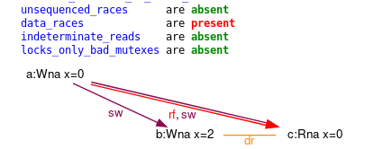
- One in which we read from (rf) b\
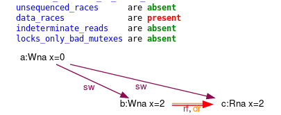

## Pseudo notification

This time there is "only one" execution but it is not consistent and has data races:

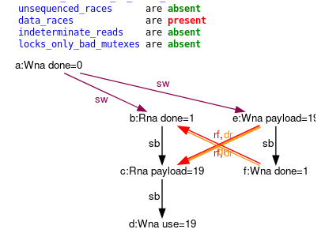

## Notification load relaxed

CppMem shows us the problem, there is no synchronize-with between write of done and read of done therefor we end up with data race on payload:

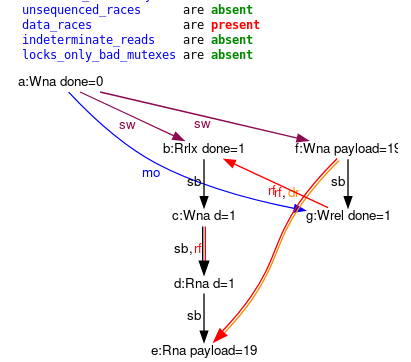

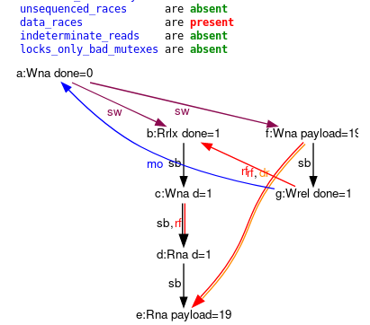

## Notification load relaxed in loop

This time we have no data race, I don't really know why CppMem does not report it:

We have one consistent execution:\
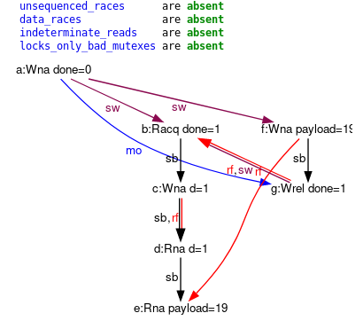

And one inconsistent execution:\
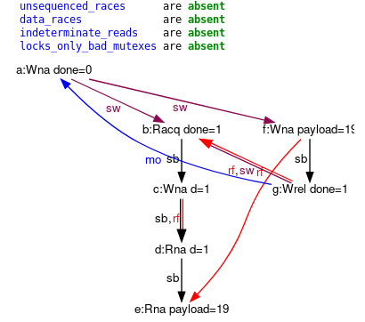

## Notification load/store relaxed

Two inconsistent executions with data race and no synchronize-with:

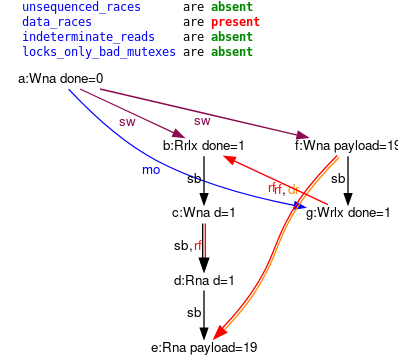

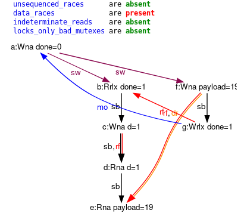

## Data race atomic fix

No data race, 8 executions, 2 consistents:

First consistent, 0 is read no synchronize-with:\
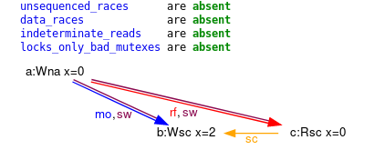

Second consistent, 2 is read with synchronize-with:\
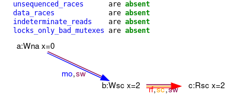

CppMem shows well that:

1. We can expect to read 0 or 2
2. Synchronize-with relation does not always appear. It is important for [notification for exemple](#Notification-fix-sequentially-consistent)

## Data race atomic fix relaxed

No data race, 4 executions, 2 consistents:

First consistent, 0 is read no synchronize-with:\
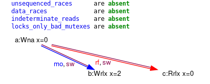

Second consistent, 2 is read no synchronize-with:\
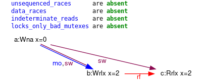

CppMem shows us that there is no sequential consistency (sc) nor synchronize-with relations when using relaxed sementic.

## Notification fix sequentially consistent

No data race, 4 executions, 1 consistent:

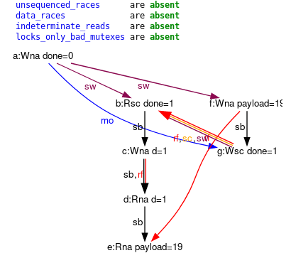

CppMem shows us that `done` read(in g) from b with a synchronize-with relation and that it is sequentially consistent(sc)

## Notification fix acquire release sementic

No data race, 2 executions, 1 consistent:

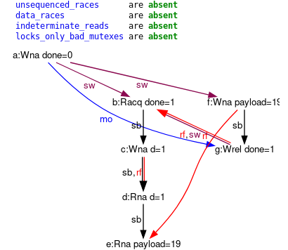

CppMem shows us that `done` read(in g) from b with a synchronize-with relation. without sequential consistency.

## store/load sequentially consistent

No data race, 384 executions, 6 consistent:

There is 3 possible results:

- 0, 1:\
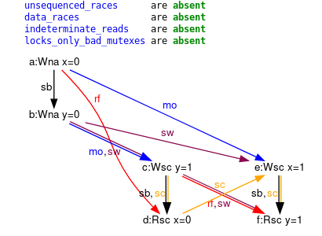
- 1, 0:\
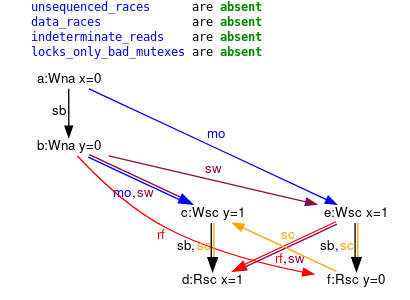
- 1, 1:\
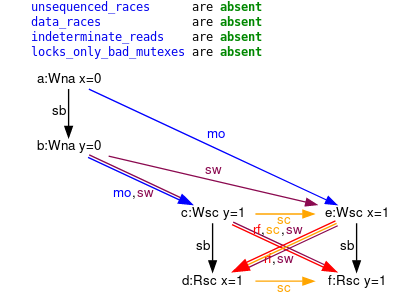

## store/load acquire release sementic

No data race, 16 executions, 4 consistents:

This time there is 4 possible results:

- 0, 1:\
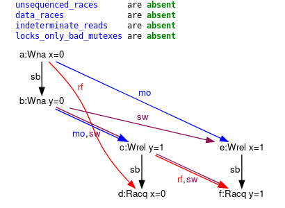
- 1, 0:\
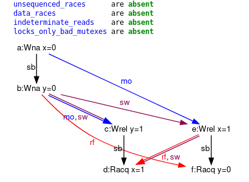
- 1, 1:\
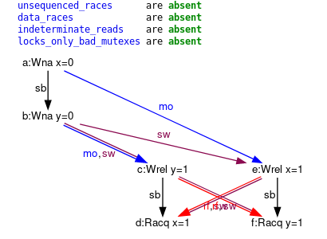
- and 0, 0:\
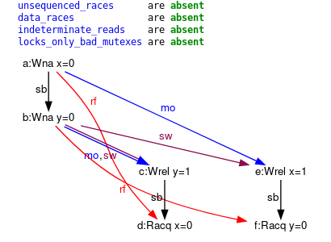

CppMem shows us that acquire release sementic isn't enough to prevent the weird result 0, 0 to appear.

## store/load relaxed

No data race, 16 executions, 4 consistents:

As expected there is 4 possible results:

- 0, 1:\

- 1, 0:\

- 1, 1:\

- and 0, 0:\

