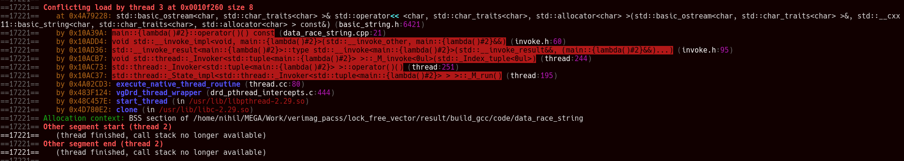
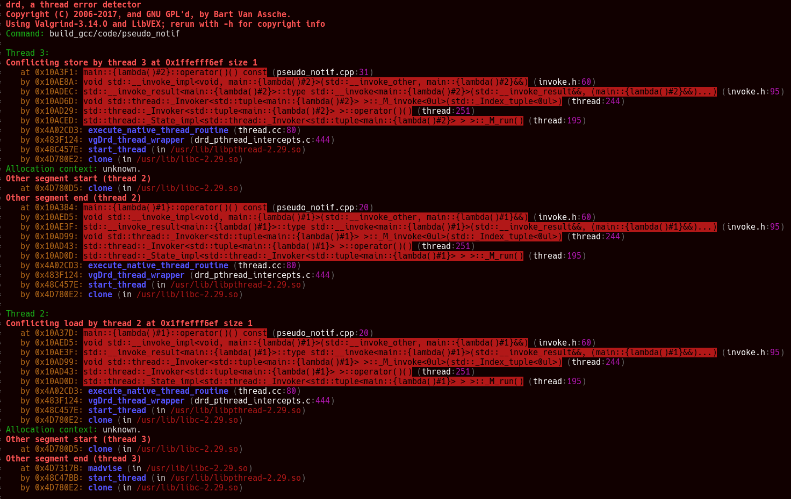
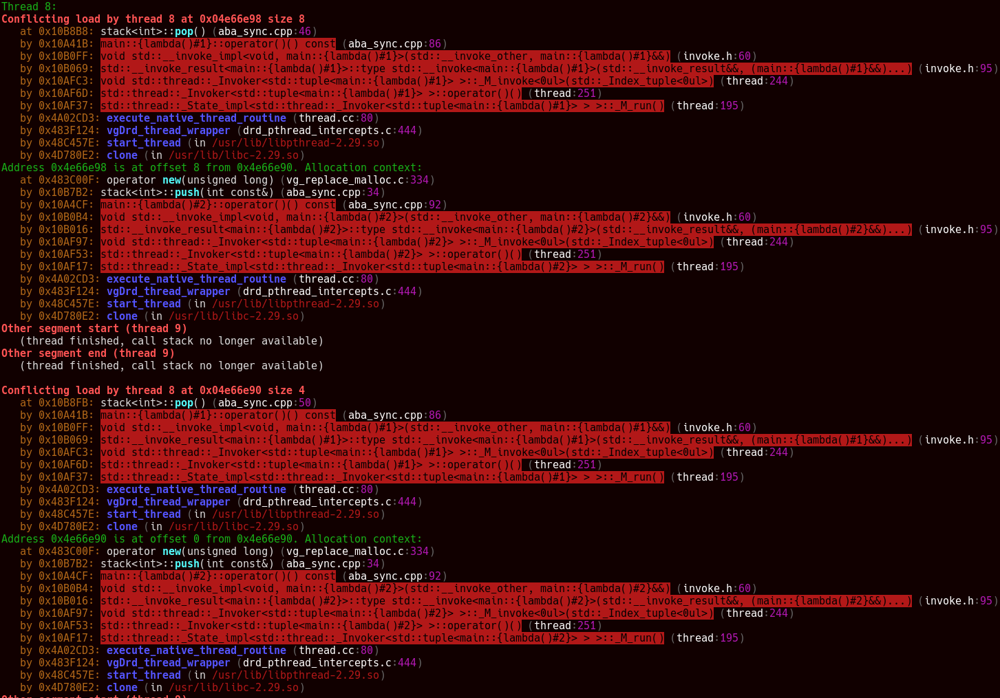

# DRD outputs

## Simple data race

We see a "Conflicting load" (data race is not clearly pointed)\
The stack of the write isn't showed because the thread has finished.

If we run drd with libc++ it will output false errors on thread creation, it could be suppressed though.

## String data race

This time it has to much output. We have 4 conflicting loads for one "real".\
The first 2 are related to the string' size;
The last 2 must be due to the way `std::cout` outputs a string.\
But we see the load (`cout`) and where the allocation took place, but not the write.

For libc++ there are 6 errors but related to the "real" one.

## Pseudo notification

We have the conflicting load and the conflicting store on `done`, perfect.
Then the 4 errors related to the string `payload` as we have seen [above](#String-data-race).

## std::map data race

DRD has generated 16 errors. it's just too much.
But we can grep our sources. And it correctly guessed the concurrent `std::map` access.

## Data race vs race condition

DRD has detected the 3 data races. And unsurprisingly nothing about the race conditions.
And again for libc++ false positive about the threading library.

## Data race on object destruction

DRD does not detect the error, but it is not really an error for DRD.
Valgrind (memcheck) catch it correctly and surely other memory checker.

## Data race on small string destruction

Same as [above](#Data-race-on-object-destruction)

## Data race on string destruction

Same as [above](#Data-race-on-object-destruction)

## ABA

DRD does not detect the ABA problem exposed in this [code](../code/aba/aba.cpp).\
Even after looping 1000 times multiple times.

## ABA synchronized

DRD detects sometimes the ABA problem when we synchronize the threads (looped 10 times, reproduced 5 times).

and with grep:

## Notification load relaxed

DRD detect the problem but because it does not support atomic and memory ordering constraints.
We must tell it with annotations.\
But if we annotate a wrong code with wrong ordering constraints it will not report errors.

## Notification load relaxed in loop

same as [above](#Notification-load-relaxed)

## Notification load/store relaxed

same as [above](#Notification-load-relaxed)

## Data race atomic fix

DRD report error on atomic operations with Gcc, but these can be [suppressed](../valgrind.supp).\
Interestingly with Clang no errors with atomics.

## Data race atomic fix relaxed

With relaxed sementic clang now report errors, again that can be suppressed.

## Notification fix

Again, as described with [wrong notification](#Notification-load-relaxed), DRD does not support memory ordering constraints.

## ABA fix

With suppressions on atomics DRD seems to not trigger errors.
