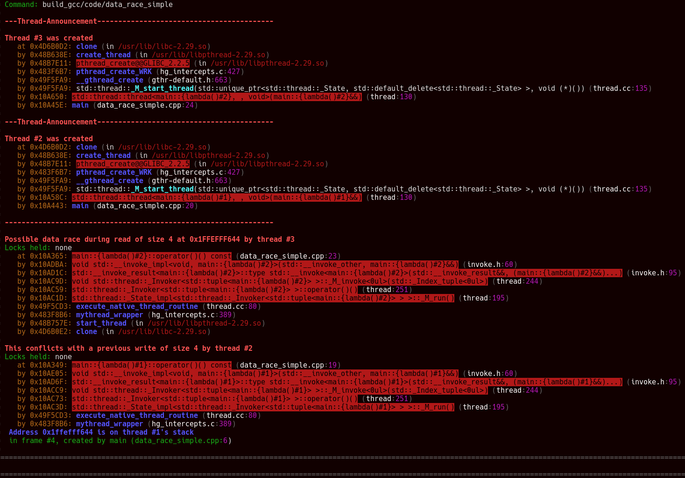

# Helgrind outputs

## Simple data race

We clearly see were are the conflicting load and store as well as where the concerned threads have been created.
And all that in a digest manner.



## String data race

It is a little bit more messy with strings (4 errors), but we have the information.

You also have the concerned symbol "_Z1xB5cxx11".
I don't know why helgrind does not demangle it. But you could do it with `c++filt`.
And here we have our variable name: `x[abi:cxx11]`


...

## Pseudo notification

Helgrind shows us the 3 data races, with duplicate, but it is clear.

Data race with notification flag:\


Data race with first part of the string:\


Data race with second part of the string:\


## std::map data race

With a lot of errors Helgrind points the race, we can watch only the first error:


## Data race vs race condition

With the little help of grep we see all the data race:

```bash
grep -E "(data_race|conflicts|data race)"
```


## Data race on object destruction

This is not really the job of helgrind to detect this, memcheck or other memory check can detect this error.

## Data race on small string destruction

Again as said [above](#Data-race-on-object-destruction) this is note the job of helgrind.

## Data race on string destruction

Again as said [above](#Data-race-on-object-destruction) this is note the job of helgrind.

## ABA

Helgrind does not detect the ABA problem exposed in this [code](../code/aba/aba.cpp).\
Even after looping 1000 times multiple times.

## ABA synchronized

Even with synchronization Helgrind does not detect the problem on Gcc.\
However with clang + libc++ Helgrind does detect a problem:


## Notification load relaxed

Helgrind detect a data race on `payload` this is good.\
However if we put annotations this hide the error. We must take care of using them correctly.\
Also atomic access must be [suppressed](../valgrind.supp).


## Notification load relaxed in loop

Same as [before](#Notification-load-relaxed) helgrind can detect the error if we use annotations correctly.

## Notification load/store relaxed

Same as [before](#Notification-load-relaxed) helgrind can detect the error if we use annotations correctly.

## Data race atomic fix

Helgrind on gcc report error on atomics and again we can suppress these, clang does not.

## Data race atomic fix relaxed

Helgrind on gcc report error on atomics and again we can suppress these, clang this time also report errors.

## Notification fix

As it was said [before](#Notification-load-relaxed) we must annotate the code to make helgrind understand the happens-before relations.

## ABA fix

Helgrind does not detect anything.
