# Intel Inspector outputs

## Simple data race

Intel Inspector detect the simple data race, showing us the conflict load and store.

Also it output a code snippet.

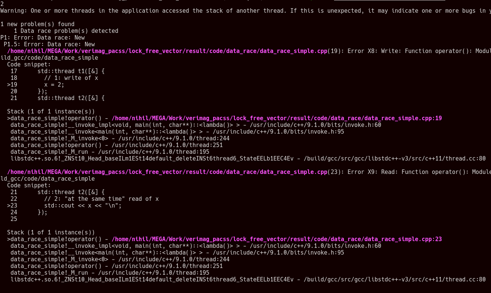

## String data race

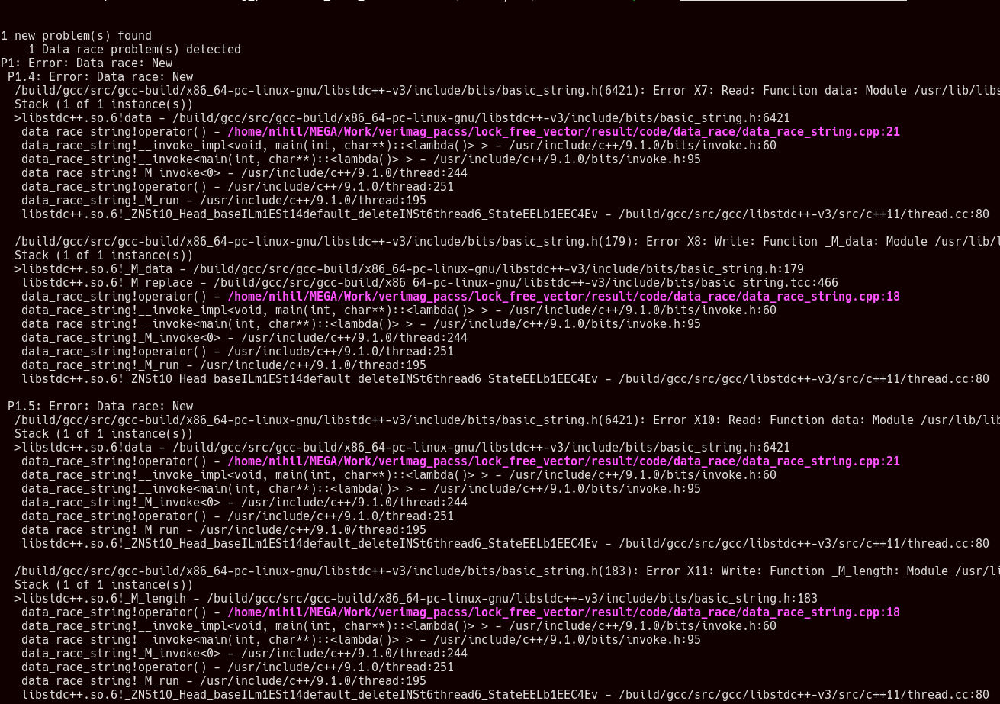

## Pseudo notification

Data race on string:\
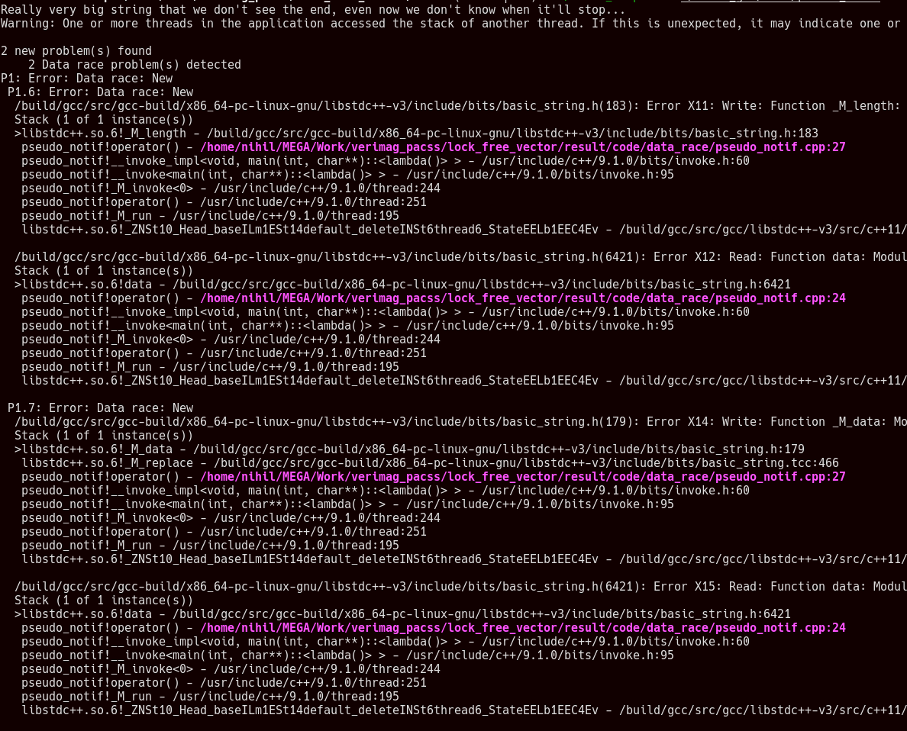

Data race on `done`:\
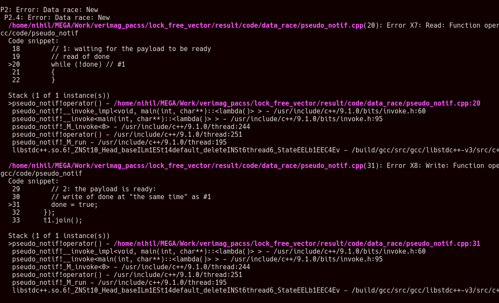

## std::map data race

With 6 errors, it detects the race:\
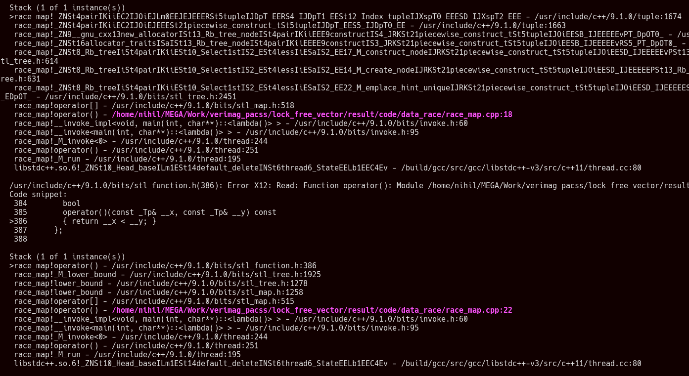

## Data race vs race condition

It detect the multiple data races:

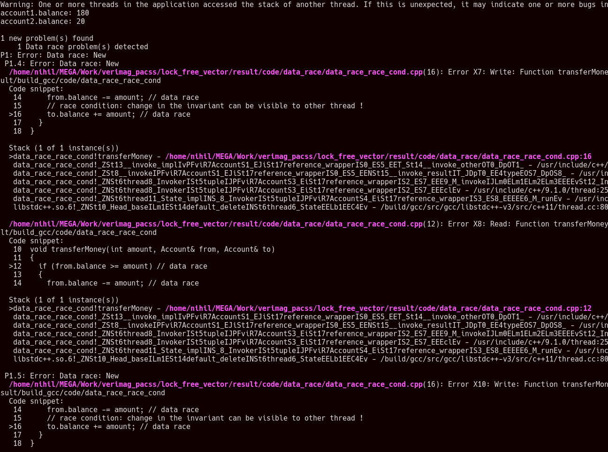

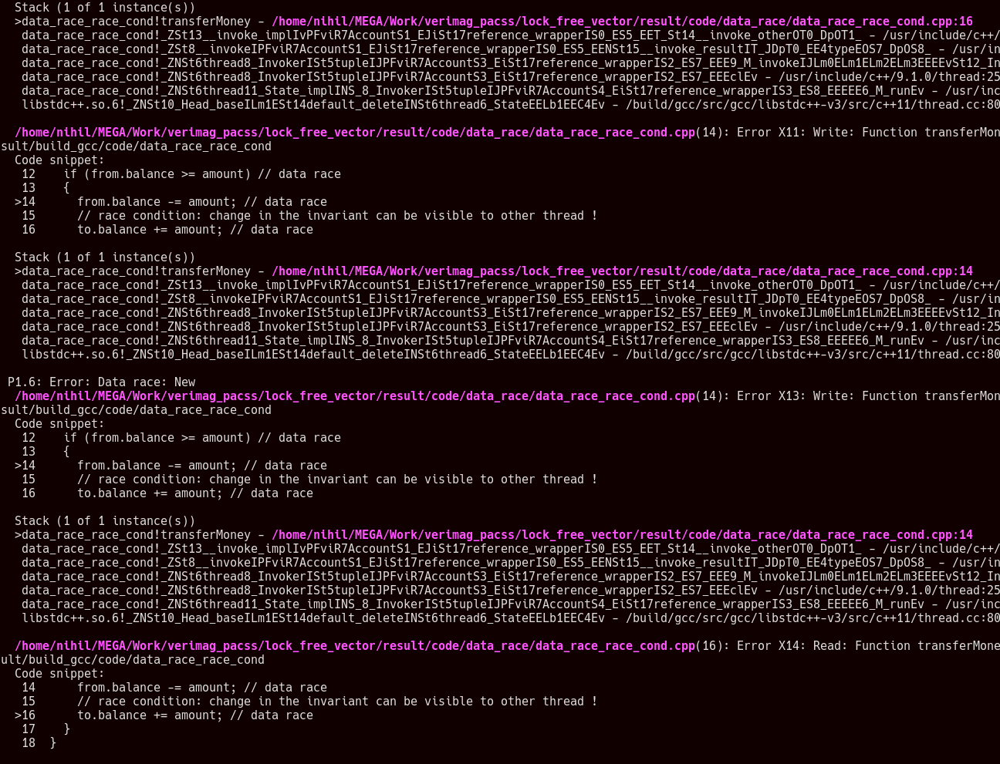

## Data race on object destruction

It does not detect anything, this is not the purpose of the data race detector in intel inspector.

## Data race on small string destruction

Same as [above](#Data-race-on-object-destruction).

## Data race on string destruction

Same as [above](#Data-race-on-object-destruction).

## ABA

Intel Inspector does not detect the ABA problem exposed in this [code](../code/aba/aba.cpp).\
Even after looping 1000 times multiple times.

## ABA synchronized

It does not detect the aba problem even synchronized on gcc.
But it detects it on clang:

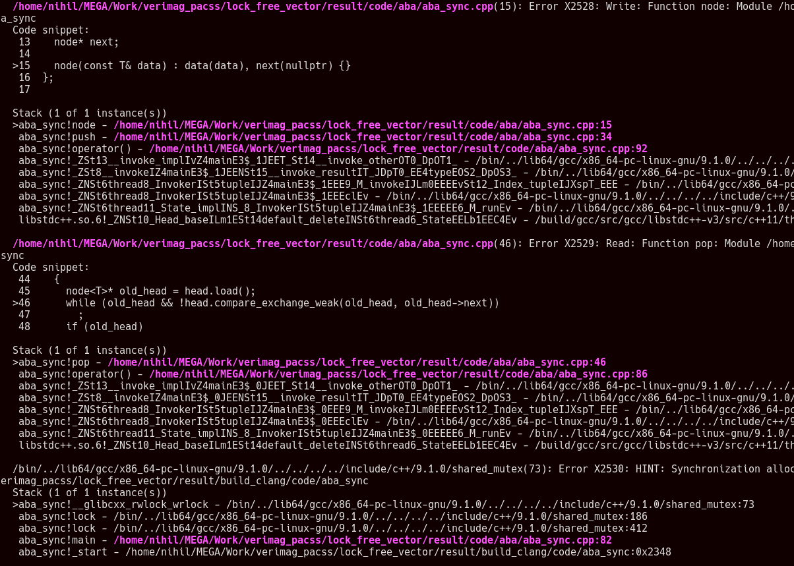\
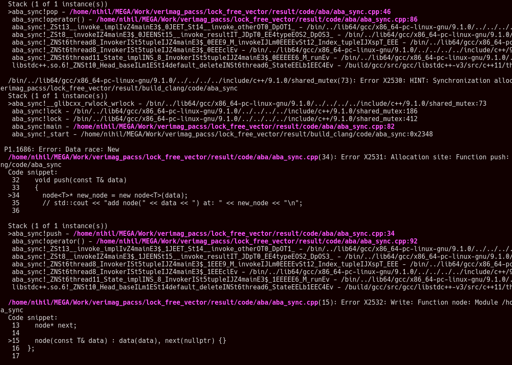\
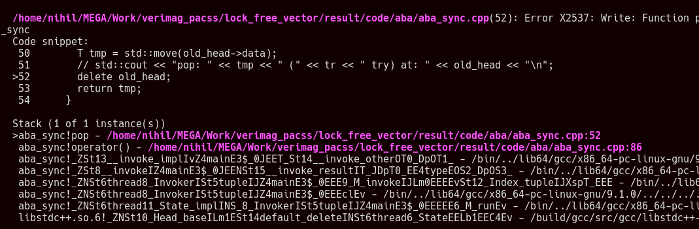

We see the delete conflicting with the while in the `pop` function.

## Notification load relaxed

Intel inspector detect a data race but does not understand nor atomics in gcc/clang nor memory ordering constraints

## Notification load relaxed in loop

Same as [above](#Notification-load-relaxed).

## Notification load/store relaxed

Same as [above](#Notification-load-relaxed).

## Data race atomic fix

Intel inspector detect a data race but does not understand nor atomics in gcc nor memory ordering constraints\
so it output error on atomic:
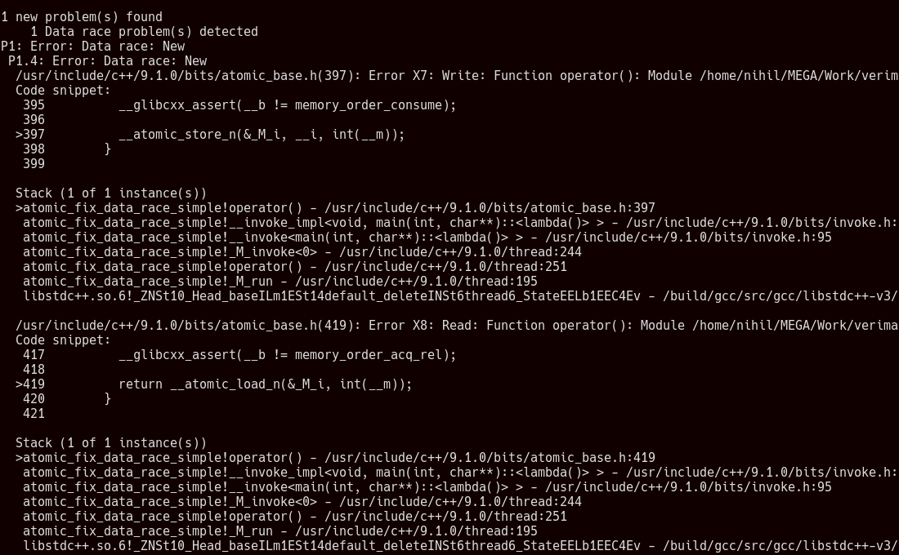

With clang it is fine.

## Data race atomic fix relaxed

As [expected](#Data-race-atomic-fix) with gcc it outputs errors an atomic.
And with clang it also provoc errors on atomics.

## Notification fix

As expected it does not understand memory ordering constraints.

## ABA fix

