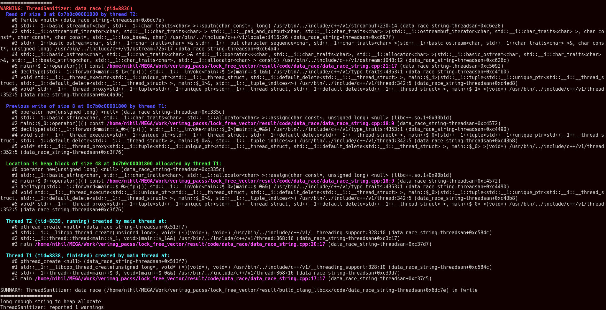
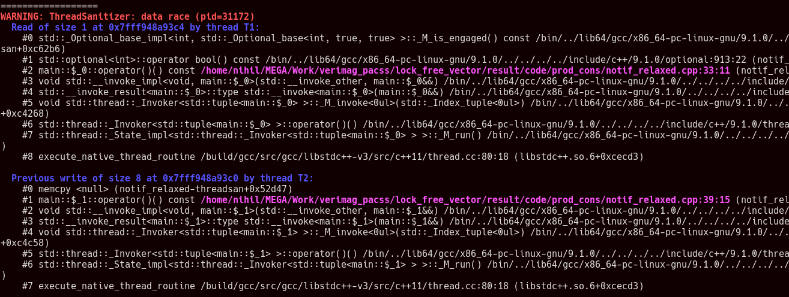

# ThreadSanitizer outputs

## Simple data race

Tsan simply output the data race:

Clang shows the column, really convenient to clearly identify where the problem is:

*note: with gcc we can add `-gcolumn-info` but that doesn't seems to be working here*

## String data race

Tsan detect the error but with libstdc++ it doesn't shows us the problem in our code:

While with libc++:

## Pseudo notification

Tsan detect the data race on `done` and `payload`:

again, we have the column with clang and with libc++ the data race on the string shows correctly where it is in our code.

## std::map data race

With 3 errors, Tsan correctly points out the errors:

## Data race vs race condition

Tsan with gcc shows the data races:

Interestingly with clang, it shows only the first one.

## Data race on object destruction

Tsan does not detect this error, but this is not its job, asan or msan should fit better here.

## Data race on small string destruction

Same as [above](#Data-race-on-object-destruction).

## Data race on string destruction

This time gcc and clang with libc++ detect the use after free problem. not clang with libstdc++ though:

## ABA

Tsan does not detect the ABA problem exposed in this [code](../code/aba/aba.cpp).\
Even after looping 1000 times multiple times.

## ABA synchronized

Tsan detect a problem when looping 10 times except with libc++ we had to loop 1000 times

The output with clang is really convenient here with column information:

## Notification load relaxed

Tsan detect the data race on `payload`:

## Notification load relaxed in loop

Tsan detect the data race on `payload`:

## Notification load/store relaxed

Tsan detect the data race on `payload`:

## Data race atomic fix

Tsan reports no errors, good.

## Data race atomic fix relaxed

Tsan reports no errors, good.

## Notification fix

Tsan reports no errors, good.
## ABA fix

Tsan reports no errors, good.
